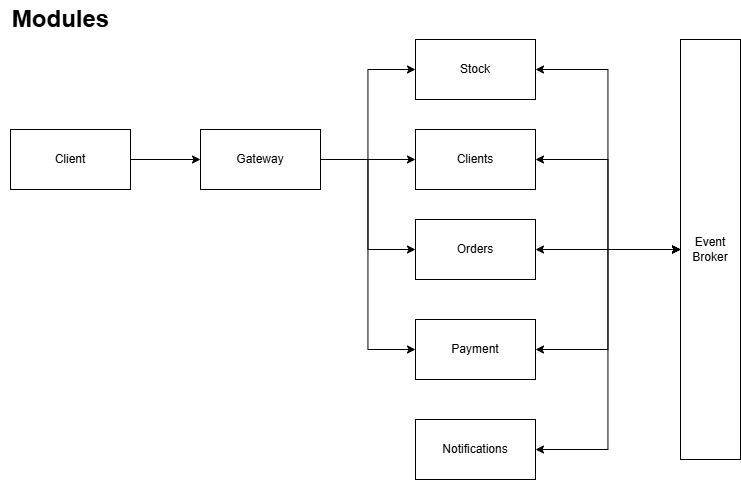
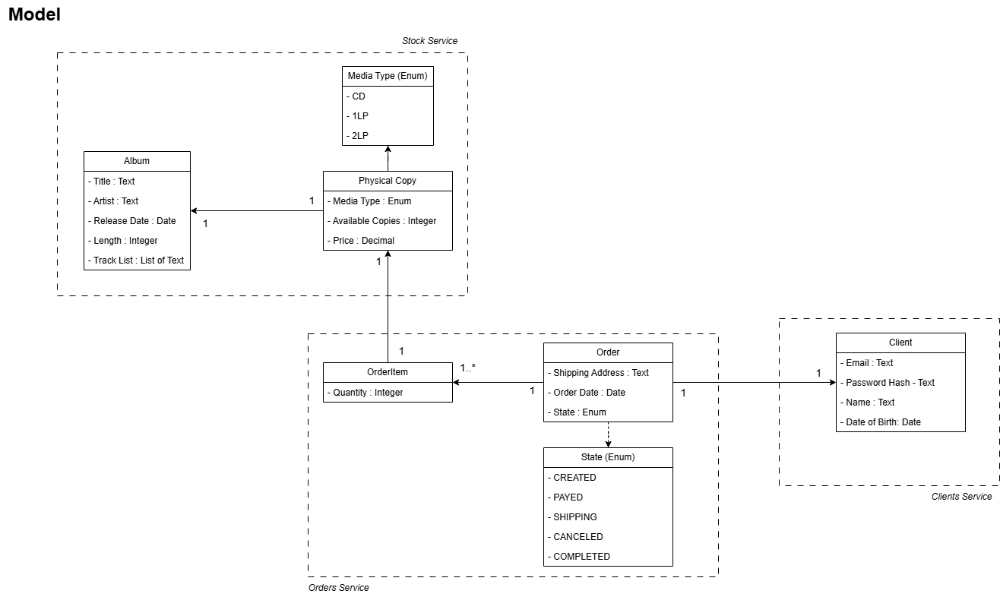
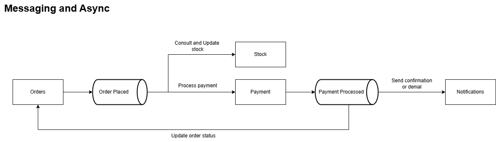

# Music Shop

This is a Java Spring microservices-based application for managing a music album shop.

## Features

This application aims to:

- 🎵 Create and consult music albums
- 💿 Create and consult physical copies of albums
-  ℹ️ Manage clients' information
- 💳 Order and pay
- ✉️ E-mail notifications

## Services

## Model

## Messaging and async

## Authors

- [@n-montanez](https://www.github.com/n-montanez)

## License
This project was developed under the
[MIT](https://choosealicense.com/licenses/mit/) license. Please reach to its documentation to know further how you could use and modify this software. 

